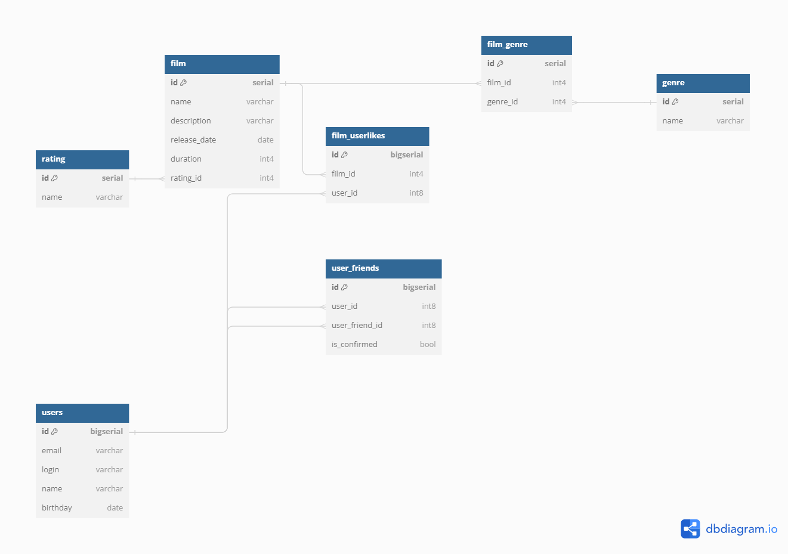

[ER-диаграмма Filmorate в DBDiagram](https://dbdiagram.io/d/Filmorate-66768c5c5a764b3c72216930)

# Комментарии
1. Все первичные ключи таблиц названы id, внешние ключи *<сущность>*[*_доп.инфо*]_id.
2. Для первичных ключей используются автоинкрементные типы serial и bigserial
3. Рейтинг вынесен из film в отдельный справочник со связью 1 к 1, т.к. каждый фильм промечается одним рейтингом, а рейтинг в свою очередь может быть навешен в будущем на другие объекты (аудио, телетрансляции и т.п.)   
4. Связи друзей на уровне БД не дублируются в обратном направлении, т.е. если есть запись о том, что Пользователь1 является другом Пользователя2, то информация об обратной связи будет получаться из запроса (см. запрос 3).
5. Запросы приведены в [ER_Filmorate.sql](ER_Filmorate.sql), выполнить можно в [SQLFiddle](https://sqlfiddle.com/postgresql/online-compiler?id=84b50b34-b4d8-4df3-8201-65b01d495d7c)

# Примеры запросов
1. Определение 10 наиболее популярных фильмов
```sql
SELECT film.id,
       film.name,
       film.description,
       film.duration,
       rating.name AS rating_name,
       fl.cnt,
       film.last_update
FROM film
INNER JOIN
     (SELECT f.id,
             COUNT(fu.user_id) AS cnt
      FROM film f
      LEFT JOIN film_userlikes fu ON fu.film_id = f.id
      GROUP BY f.id
      ORDER BY COUNT(fu.user_id) DESC
          LIMIT 10) fl ON fl.id = film.id
LEFT JOIN rating ON film.rating_id = rating.id;
```

2. Поиск фильмов по жанру (`DISTINCT` нужен, т.к. в поиске указано несколько жанров, а фильм может принадлежать нескольким жанрам)
```sql
SELECT DISTINCT f.id,
                f.name,
                f.description,
                f.duration,
                rating.name AS rating_name,
                f.last_update
FROM film f
LEFT JOIN film_genre fg ON f.id = fg.film_id
LEFT JOIN genre g ON fg.genre_id = g.genre_id
LEFT JOIN rating ON f.rating_id = rating.id
WHERE g.name IN ('комедия',
                 'боевик');
```

3. Определение друзей пользователя (используются параметры `${userId}`). Используется фильтр `is_confirmed` для выделения одобренных заявок.
```sql
SELECT u.id,
       u.email,
       u.login,
       u.name,
       u.birthday
FROM users u
         INNER JOIN
     (SELECT user_id,
             user_friend_id
      FROM user_friends
      WHERE is_confirmed
      UNION ALL
      SELECT user_friend_id,
             user_id
      FROM user_friends
      WHERE is_confirmed ) all_user_friends ON all_user_friends.user_friend_id = u.id
WHERE all_user_friends.user_id = ${userId};
```

4. Определение общих друзей пользователя (используются параметры `${userId}`, `${friendId}`)
```sql
--все друзья
WITH all_user_friends AS
         (SELECT user_id,
                 user_friend_id
          FROM user_friends
          WHERE is_confirmed
          UNION ALL
          SELECT user_friend_id,
                 user_id
          FROM user_friends
          WHERE is_confirmed )
        ,
     first_friends AS --друзья первого пользователя
         (SELECT fuf.user_friend_id
          FROM all_user_friends fuf
          WHERE fuf.user_id = ${userId} )
        ,
     second_friends AS --друзья второго пользователя
         (SELECT suf.user_friend_id
          FROM all_user_friends suf
          WHERE suf.user_id = ${friendId} )
SELECT u.id,
       u.email,
       u.login,
       u.name,
       u.birthday
FROM first_friends ff
         INNER JOIN second_friends sf ON sf.user_friend_id = ff.user_friend_id --пересечение списка друзей
         INNER JOIN users u ON sf.user_friend_id = u.id
```